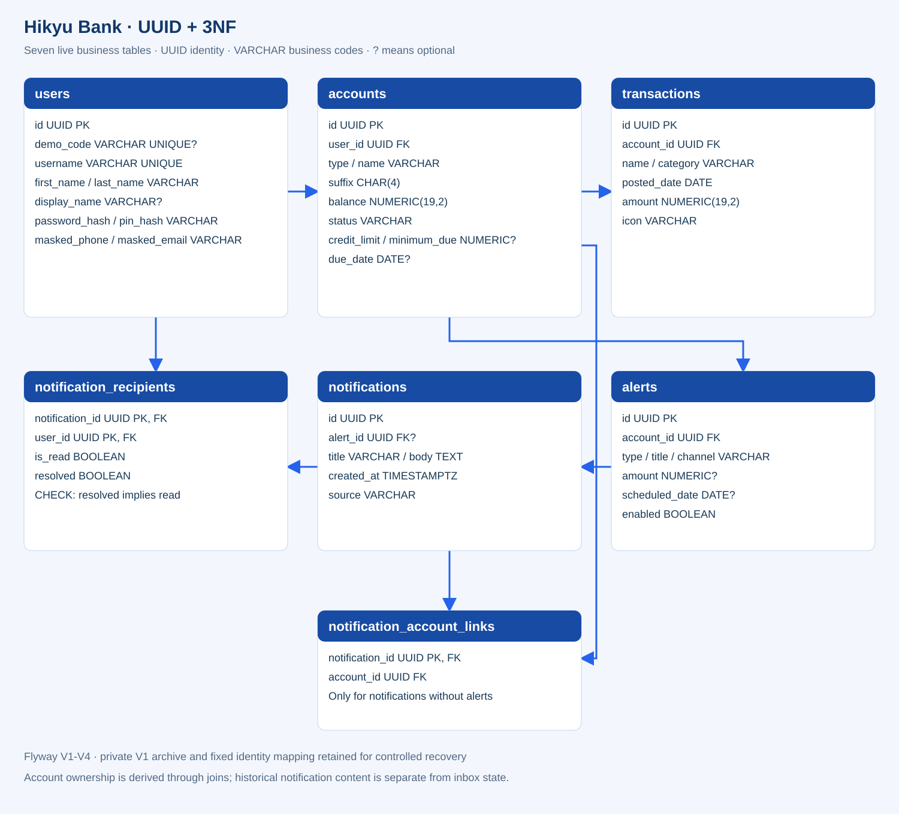

# Database assignment report — PostgreSQL

## Step 1 — Platform selection

Chosen database: **PostgreSQL**, a relational SQL database. The runtime is local,
using PostgreSQL 17, Java Spring Boot and a modular HTML/CSS/JavaScript frontend.
No Airtable runtime, public signup, real bank connection or financial transfer.

The assignment asks for AI-powered LCNC platform work. PostgreSQL alone is not an
LCNC UI or embedded AI assistant. This delivery implements the relational database
and AI-assisted code/schema work. A PostgreSQL-backed platform such as Supabase
can provide the visual/AI exercise; genuine platform evidence remains pending.

## Step 2 — Schema and example data

Seven business tables: users, accounts, transactions, alerts, notifications,
notification_recipients and notification_account_links. The full field
dictionary is in DATABASE-DESIGN.md; the authoritative schema is the Flyway V1-V4
migrations. The diagram below shows the implemented fields and relationships.
UUID foreign keys, owner-scoped queries and ownership triggers enforce valid links, a partial unique index limits
open checking/savings accounts, and NUMERIC(19,2) preserves exact money values.

Three synthetic profiles: Gospelhope David, Cheng-Yang Lee and Mingyu Fan. Initial
seed counts are 3 users, 9 accounts, 36 transactions, 9 alerts and 3 notifications.
Different profile balances/IDs enable a multi-user demonstration. Startup seeds
missing profiles atomically; existing users and their edits/deletions are preserved.

## Step 3 — Integration and dynamic content

The browser uses REST controllers, which pass session-derived owner identity to
application services. Repository interfaces are implemented by parameterized JDBC
adapters. PostgreSQL returns persisted values as domain records/JSON for UI display.
The browser holds no database credential and cannot choose another user's owner ID.

Alert rules provide complete CRUD through the UI and REST API. Inbox test messages
support create/list/read/resolve/delete, and account applications support create/read
with pending status for credit/loan/investment products. Historical transactions
are read-only. SQL query examples and the AI prompt workflow are in database/.

## Step 4 — Testing and edge cases

Completed on a real local PostgreSQL 17.6 server:

- 19 controller/service/repository integration tests: MFA, session lifecycle,
  validation, CRUD, duplicate-account messaging and multi-user isolation.
- 12 database tests: foreign keys, unique checking constraint, ownership-preserving
  upserts, hashed credentials/decimals and no restoration of deleted seed records.
- 6 frontend transport/render checks: REST serialization/errors, profiles,
  account cards and HTML escaping.
- Packaged-JAR smoke test: start twice, verify persistence, session reset,
  three-profile access, alert/inbox state and cross-user 404 responses.

No H2 or mocked provider substitutes were used for database verification. See
VERIFICATION.md and test-results.json. Browser visual testing, native Mac/Windows
launching, platform AI execution and hosted-platform screenshots were not performed.

## Step 5 — Documentation

### AI assistance explanation

AI assistance helped translate Hikyu Bank's existing models into a PostgreSQL schema, generate parameterized JDBC repositories, and propose tests for ownership and persistence. We reviewed the generated design and added owner-scoped account joins and notification ownership guards, exact decimal columns, a partial unique index, and transactional seeding. Real PostgreSQL tests then checked CRUD, invalid references, duplicate accounts, and restart behavior. PostgreSQL itself does not include a conversational schema assistant, so this work represents AI-assisted coding rather than an executed LCNC platform feature. For the platform-specific requirement, the team can use a PostgreSQL-backed platform such as Supabase, review its AI-generated schema or queries, and capture genuine visual evidence. Those platform actions have not been performed in this delivery and should be documented before claiming that requirement is complete.

### Relational database choice (125 words)

We selected PostgreSQL because Hikyu Bank contains structured entities with clear relationships among users, accounts, transactions, alerts, and notifications. A relational design makes ownership links explicit and supports foreign keys, uniqueness constraints, exact decimal storage, and transactions. These features are useful when multiple users interact with the same backend and when alert updates must remain consistent. PostgreSQL also integrates with Spring Boot through JDBC, allowing the frontend to keep its existing REST contract while records become durable. The choice improves maintainability through versioned migrations and makes database rules reviewable by teammates. It adds operational responsibilities, including server configuration, backups, permissions, and migration management. For this classroom project, Docker Compose simplifies local startup while all financial activity remains synthetic and no real banking transactions are processed.

## Submission evidence checklist

The project includes the schema diagram, field dictionary, REST API documentation,
architecture diagram, sample queries, test sources and local results. If the rubric
requires an LCNC platform diagram/screenshot, obtain one from actual platform use;
the supplied SVG is not a substitute for a screenshot that specifically proves
platform execution. Follow database/AI-WORKFLOW.md and attach actual AI output,
review corrections and a query/UI result rather than claiming unperformed work.

## References

- PostgreSQL constraints: https://www.postgresql.org/docs/17/ddl-constraints.html
- PostgreSQL numeric types: https://www.postgresql.org/docs/17/datatype-numeric.html
- Spring Boot database initialization: https://docs.spring.io/spring-boot/3.5/how-to/data-initialization.html
- Optional Supabase AI assistant: https://supabase.com/features/ai-assistant
- Supabase AI IDE prompts: https://supabase.com/docs/guides/ai-tools/ai-prompts
